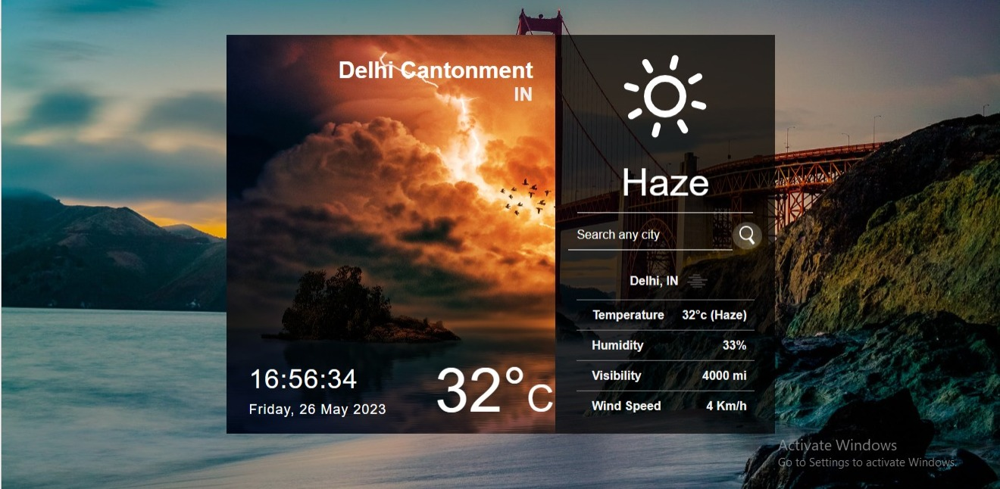

<br/>

[Weather App](https://weather-app-reactjs-openweather.netlify.app/) app is developed using React.js and OpenWeatherMap API. User can search locations by city name and observe the weather.

# Weather App:

Link: https://weather-app-reactjs-openweather.netlify.app/

- This is a weather application developed with React that utilizes APIs to provide real-time weather information.

# Features
- Display the current weather forecast based on the user's location.
- Allow the user to search for the weather of a specific city.
- Provide an intuitive and responsive user interface.
- Displays the current date,day and time
- On launch, find user location weather by utilizing GeolocationAPI
# Technologies Used
- React
- HTML
- CSS
- OpenWeatherMap API

# Getting Started

- Make sure you already have `Node.js` and `npm` installed in your system.
- You need an API key from [OpenWeatherMap](https://openweathermap.org/). After creating an account, [grab your key](https://home.openweathermap.org/api_keys).
- Then, under the `src` directory, go to `apiKeys.js` and replace `API_KEY` with your OpenWeatherMap API Key.

# Install

In the terminal run these commands:

```
git clone https://github.com/amandeep2326/Weather-App-by-React.git
npm i
npm start
```


## Todos

- [ ] Implement an auto-complete feature for the city name input field.
- [ ] Celcius/Fahrenheit conversion
- [ ] Theme Conversion - Dark/Light Mode

<br/>
Thank You ^_^
